# 📝 Báo Cáo Khóa Luận — Cập Nhật Chương 4, 5, Kết Luận & 22 Biểu Đồ Mermaid (02-11-2026)

> [!IMPORTANT]
> Báo cáo chính nằm trên Google Doc: https://docs.google.com/document/d/1maZALMYXxLZdKnyXzSNHpuGgvo5mAkLw315eNCBDge8/edit
> Mọi số liệu dưới đây được đo trực tiếp ngày 02/11/2026 hoặc đọc từ mã nguồn hiện tại.

## 1. Những gì đã thêm vào Google Doc

| Phần | Nội dung |
|---|---|
| Chương 3 | 10 biểu đồ (H3.1–H3.10): use case, kiến trúc đa lớp, đa tác tử, ERD, WF01–WF04, auth, frontend |
| Chương 4 | Môi trường, cài đặt 6 chức năng nghiệp vụ + 3 tác tử AI, kiểm thử, thực nghiệm, trả lời CH1–CH4; 12 biểu đồ (H4.1–H4.12), 9 bảng |
| Chương 5 | Bảng 10 màn hình, đối chiếu yêu cầu phi chức năng, hạn chế, hướng phát triển |
| Kết luận | Tổng kết đóng góp, hạn chế, hướng phát triển |
| Tham khảo | Thêm [14]–[41]; thay [12] sai bằng Potvin & Levenberg (CACM 2016) |
| Mục lục | Thêm mục Chương 4, 5, Kết luận |

## 2. Sửa Chương 1–3 cho khớp code

- RBAC chỉ còn **2 role ADMIN / EMPLOYEE** (bảng 3.1, 3.5, đoạn 3.5.1)
- Thuế TNCN theo giai đoạn: **7 bậc trước 01/7/2026 → 5 bậc từ 01/7/2026**; giảm trừ 15,5tr / 6,2tr; trần BH 46,8tr → 50,6tr
- Nhãn PII: `[MASKED_ID]`, `[MASKED_PHONE]`, `[MASKED_EMAIL]`
- JWT: refresh 30 ngày, access TTL theo `SecurityPolicy.accessTokenTtlHours` (720h)
- Web Portal: 1 route, AppShell lọc tab theo role
- "sáu chương" → "năm chương"; bảng module thay `N8nModule` bằng `SlackModule`

## 3. Kết quả kiểm thử & thực nghiệm (02/11/2026)

| Hạng mục | Kết quả |
|---|---|
| Jest (`apps/api`) | Lần đầu **47/47**; sau sửa lỗi **49/49**, 6 suites |
| `scripts/test-all-endpoints.mjs` | Lần đầu **55/57**; sau sửa lỗi **59/59** (thêm kiểm tra webhook thiếu khóa) |
| `scripts/test-security.mjs` | Lần đầu 12/14 phần đổi mật khẩu (giới hạn tốc độ); sau sửa lỗi **12/12** |
| Router intent (`scripts/eval/eval-router.mjs`, 80 câu) | Accuracy **83,8%**, macro-F1 **0,838**, 0,05 ms/tin nhắn |
| PII regex (9 ca biên) | 9/9 đúng đặc tả (không che máy bàn, số có dấu cách; che thừa dãy 9/12 số) |
| RAG pgvector 0.8.6 + HNSW | 0,65–0,78 s; top-1 đúng chủ đề (cosine 0,609 / 0,559) |
| Chat portal end-to-end | 3,91 s / 8,45 s / 6,08 s; trả đúng 12 ngày phép nhưng LLM ghi sai "năm 2024" |
| DB snapshot | 31 NV, 2.186 chấm công, 139 phiếu lương, 10 policy chunks, 107 phiên AI / 336 tin nhắn |

Ma trận nhầm lẫn Router (hàng = thực tế):

| | HR_QA | TRAINING | CSKH | OTHER |
|---|---|---|---|---|
| HR_QA | 20 | 0 | 0 | 0 |
| TRAINING | 0 | 15 | 0 | 5 |
| CSKH | 1 | 0 | 12 | 7 |
| OTHER | 0 | 0 | 0 | 20 |

## 4. Hạn chế phát hiện khi đối chiếu code → đã sửa ngày 02/11/2026

Toàn bộ 16 vấn đề của đợt rà soát đã được khắc phục và kiểm thử lại — xem [[32 - Rà Soát & Sửa 16 Lỗi Mã Nguồn (02-11-2026)]].

- [x] WF04 `Is Bot Active?` nối cả hai nhánh → nhánh false chỉ lưu tin (`Save Message (Bot Muted)`)
- [x] Geofence chỉ kiểm tra ở client → server tính Haversine, 400/403
- [x] `POST /leave` nhận `employeeId` tùy ý → EMPLOYEE luôn tạo đơn cho chính mình
- [x] Webhook n8n không khóa → Header Auth `x-api-key`, cổng Docker chỉ mở 127.0.0.1; xóa WF05; `timingSafeEqual`
- [x] Route `PATCH /training/sessions/:id/grade` không dùng được → đã xóa
- [x] Giảm trừ 11tr/15,5tr lệch nhau, prompt WF02 cũ → `defaultSalaryConfigFor`, mốc 01/01/2026, prompt mới
- [ ] Tài liệu [18] (NĐ 161/2026/NĐ-CP) mới xác nhận qua báo chí, cần đối chiếu văn bản gốc

## 4b. Cập nhật Google Doc ngày 02/11/2026 (lần 2)

- Thêm **46 footnote**: mỗi trích dẫn [1]–[41] ở lần xuất hiện đầu tiên có chú thích cuối trang ghi đầy đủ nguồn; 5 tham chiếu "ghi chú NN" có chú thích trỏ tới tệp nhật ký trong `Khóa Luận/`.
- Mục 5.3 đổi thành **"Rà soát mã nguồn và hạn chế còn lại"** kèm Bảng 5.3 (vấn đề → cách sửa → kiểm chứng).
- Cập nhật 3.4.4, 3.5.2, 4.2.3–4.2.5, 4.3.3, 4.4, 4.6 (CH4), tiểu kết, kết luận; Bảng 4.3 thêm `payroll.service.spec.ts` (49/49), Bảng 4.4 ghi kết quả trước/sau sửa.
- Biểu đồ cập nhật: H3.5, H3.8 (nhánh Bot Muted), H4.3 (geofence server), H4.12.

## 5. Tệp liên quan trong repo

- `docs/diagrams/*.mmd` (+ `.svg`, `.png` render local) — 22 biểu đồ
- `scripts/eval/intent-dataset.json`, `scripts/eval/eval-router.mjs` — thực nghiệm Router

## 6. Toàn bộ biểu đồ Mermaid

### Hình 3.1. Sơ đồ ca sử dụng tổng quát

`docs/diagrams/H3-01-use-case.mmd`

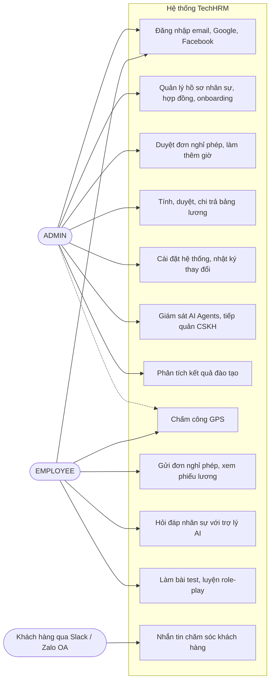
```mermaid
flowchart LR
  A(["ADMIN"])
  E(["EMPLOYEE"])
  K(["Khách hàng qua Slack / Zalo OA"])
  subgraph S["Hệ thống TechHRM"]
    UC1["Đăng nhập email, Google, Facebook"]
    UC2["Quản lý hồ sơ nhân sự, hợp đồng, onboarding"]
    UC3["Duyệt đơn nghỉ phép, làm thêm giờ"]
    UC4["Tính, duyệt, chi trả bảng lương"]
    UC5["Cài đặt hệ thống, nhật ký thay đổi"]
    UC6["Giám sát AI Agents, tiếp quản CSKH"]
    UC7["Phân tích kết quả đào tạo"]
    UC8["Chấm công GPS"]
    UC9["Gửi đơn nghỉ phép, xem phiếu lương"]
    UC10["Hỏi đáp nhân sự với trợ lý AI"]
    UC11["Làm bài test, luyện role-play"]
    UC12["Nhắn tin chăm sóc khách hàng"]
  end
  A --> UC1 & UC2 & UC3 & UC4 & UC5 & UC6 & UC7
  A -.-> UC8
  E --> UC1 & UC8 & UC9 & UC10 & UC11
  K --> UC12
```

### Hình 3.2. Kiến trúc tổng thể đa lớp

`docs/diagrams/H3-02-architecture.mmd`

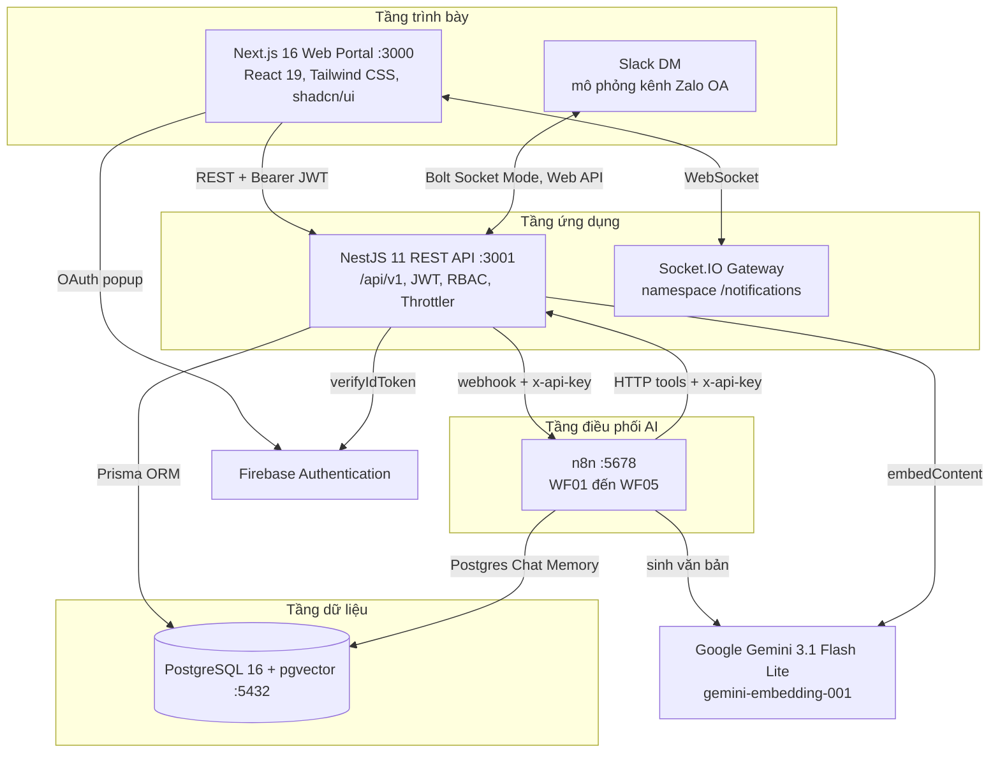
```mermaid
flowchart TB
  subgraph P["Tầng trình bày"]
    WEB["Next.js 16 Web Portal :3000<br/>React 19, Tailwind CSS, shadcn/ui"]
    SL["Slack DM<br/>mô phỏng kênh Zalo OA"]
  end
  subgraph A["Tầng ứng dụng"]
    API["NestJS 11 REST API :3001<br/>/api/v1, JWT, RBAC, Throttler"]
    WS["Socket.IO Gateway<br/>namespace /notifications"]
  end
  subgraph O["Tầng điều phối AI"]
    N8N["n8n :5678<br/>WF01 đến WF05"]
  end
  subgraph D["Tầng dữ liệu"]
    PG[("PostgreSQL 16 + pgvector :5432")]
  end
  EXT["Google Gemini 3.1 Flash Lite<br/>gemini-embedding-001"]
  FB["Firebase Authentication"]
  WEB -->|"REST + Bearer JWT"| API
  WEB <-->|"WebSocket"| WS
  WEB -->|"OAuth popup"| FB
  API -->|"verifyIdToken"| FB
  SL <-->|"Bolt Socket Mode, Web API"| API
  API -->|"webhook + x-api-key"| N8N
  N8N -->|"HTTP tools + x-api-key"| API
  API -->|"Prisma ORM"| PG
  N8N -->|"Postgres Chat Memory"| PG
  N8N -->|"sinh văn bản"| EXT
  API -->|"embedContent"| EXT
```

### Hình 3.3. Kiến trúc đa tác tử

`docs/diagrams/H3-03-multi-agent.mmd`

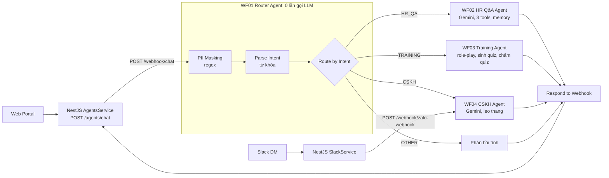
```mermaid
flowchart LR
  WP["Web Portal"] --> AS["NestJS AgentsService<br/>POST /agents/chat"]
  SD["Slack DM"] --> SS["NestJS SlackService"]
  AS -->|"POST /webhook/chat"| M
  subgraph W1["WF01 Router Agent: 0 lần gọi LLM"]
    M["PII Masking<br/>regex"] --> I["Parse Intent<br/>từ khóa"] --> SW{"Route by Intent"}
  end
  SW -->|"HR_QA"| W2["WF02 HR Q&A Agent<br/>Gemini, 3 tools, memory"]
  SW -->|"TRAINING"| W3["WF03 Training Agent<br/>role-play, sinh quiz, chấm quiz"]
  SW -->|"CSKH"| W4["WF04 CSKH Agent<br/>Gemini, leo thang"]
  SW -->|"OTHER"| ST["Phản hồi tĩnh"]
  SS -->|"POST /webhook/zalo-webhook"| W4
  W2 & W3 & W4 & ST --> R["Respond to Webhook"] --> AS
```

### Hình 3.4. Sơ đồ thực thể - liên kết

`docs/diagrams/H3-04-erd.mmd`

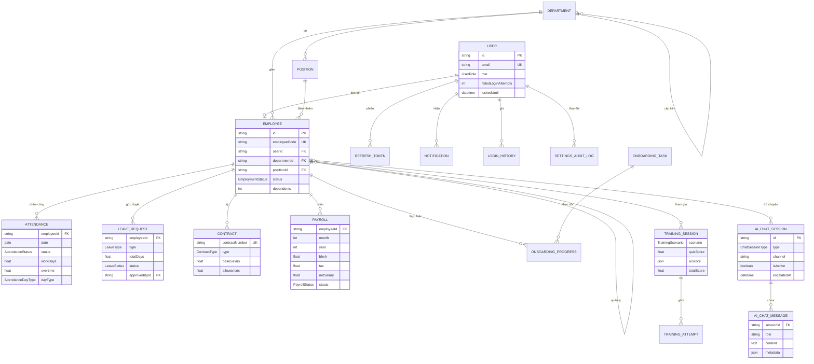
```mermaid
erDiagram
  USER ||--o| EMPLOYEE : "liên kết"
  USER ||--o{ REFRESH_TOKEN : "phiên"
  USER ||--o{ NOTIFICATION : "nhận"
  USER ||--o{ LOGIN_HISTORY : "ghi"
  USER ||--o{ SETTINGS_AUDIT_LOG : "thay đổi"
  DEPARTMENT ||--o{ DEPARTMENT : "cấp trên"
  DEPARTMENT ||--o{ POSITION : "có"
  DEPARTMENT ||--o{ EMPLOYEE : "gồm"
  POSITION ||--o{ EMPLOYEE : "đảm nhiệm"
  EMPLOYEE ||--o{ EMPLOYEE : "quản lý"
  EMPLOYEE ||--o{ ATTENDANCE : "chấm công"
  EMPLOYEE ||--o{ LEAVE_REQUEST : "gửi, duyệt"
  EMPLOYEE ||--o{ CONTRACT : "ký"
  EMPLOYEE ||--o{ PAYROLL : "nhận"
  EMPLOYEE ||--o{ ONBOARDING_PROGRESS : "thực hiện"
  ONBOARDING_TASK ||--o{ ONBOARDING_PROGRESS : "theo dõi"
  EMPLOYEE ||--o{ TRAINING_SESSION : "tham gia"
  TRAINING_SESSION ||--o{ TRAINING_ATTEMPT : "gồm"
  EMPLOYEE |o--o{ AI_CHAT_SESSION : "trò chuyện"
  AI_CHAT_SESSION ||--o{ AI_CHAT_MESSAGE : "chứa"
  USER {
    string id PK
    string email UK
    UserRole role
    int failedLoginAttempts
    datetime lockedUntil
  }
  EMPLOYEE {
    string id PK
    string employeeCode UK
    string userId FK
    string departmentId FK
    string positionId FK
    EmploymentStatus status
    int dependents
  }
  ATTENDANCE {
    string employeeId FK
    date date
    AttendanceStatus status
    float workDays
    float overtime
    AttendanceDayType dayType
  }
  LEAVE_REQUEST {
    string employeeId FK
    LeaveType type
    float totalDays
    LeaveStatus status
    string approvedById FK
  }
  CONTRACT {
    string contractNumber UK
    ContractType type
    float baseSalary
    float allowances
  }
  PAYROLL {
    string employeeId FK
    int month
    int year
    float bhxh
    float tax
    float netSalary
    PayrollStatus status
  }
  AI_CHAT_SESSION {
    string id PK
    ChatSessionType type
    string channel
    boolean isActive
    datetime escalatedAt
  }
  AI_CHAT_MESSAGE {
    string sessionId FK
    string role
    text content
    json metadata
  }
  TRAINING_SESSION {
    TrainingScenario scenario
    float quizScore
    json aiScore
    float totalScore
  }
```

### Hình 3.5. Router Agent (WF01)

`docs/diagrams/H3-05-wf01-router.mmd`

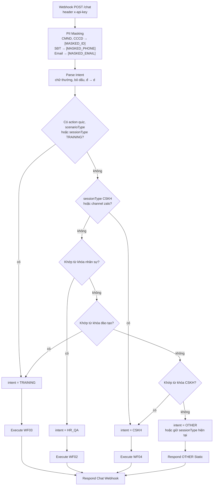
```mermaid
flowchart TD
  A["Webhook POST /chat<br/>header x-api-key"] --> B["PII Masking<br/>CMND, CCCD → [MASKED_ID]<br/>SĐT → [MASKED_PHONE]<br/>Email → [MASKED_EMAIL]"]
  B --> C["Parse Intent<br/>chữ thường, bỏ dấu, đ → d"]
  C --> D{"Có action quiz, scenarioType<br/>hoặc sessionType TRAINING?"}
  D -->|"có"| T["intent = TRAINING"]
  D -->|"không"| E{"sessionType CSKH<br/>hoặc channel zalo?"}
  E -->|"có"| CS["intent = CSKH"]
  E -->|"không"| F{"Khớp từ khóa nhân sự?"}
  F -->|"có"| H["intent = HR_QA"]
  F -->|"không"| G{"Khớp từ khóa đào tạo?"}
  G -->|"có"| T
  G -->|"không"| K{"Khớp từ khóa CSKH?"}
  K -->|"có"| CS
  K -->|"không"| O["intent = OTHER<br/>hoặc giữ sessionType hiện tại"]
  T --> X1["Execute WF03"]
  H --> X2["Execute WF02"]
  CS --> X3["Execute WF04"]
  O --> X4["Respond OTHER Static"]
  X1 & X2 & X3 & X4 --> R["Respond Chat Webhook"]
```

### Hình 3.6. HR Agent (WF02)

`docs/diagrams/H3-06-wf02-hr.mmd`

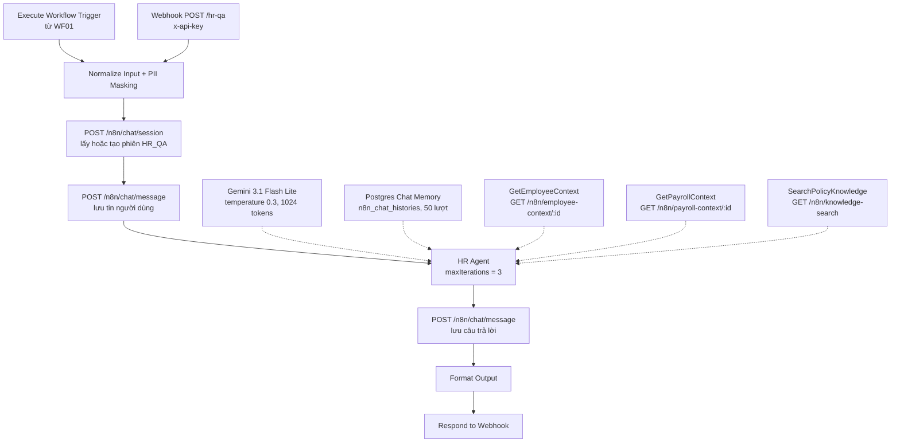
```mermaid
flowchart TD
  A1["Execute Workflow Trigger<br/>từ WF01"] --> N
  A2["Webhook POST /hr-qa<br/>x-api-key"] --> N
  N["Normalize Input + PII Masking"] --> S["POST /n8n/chat/session<br/>lấy hoặc tạo phiên HR_QA"]
  S --> U["POST /n8n/chat/message<br/>lưu tin người dùng"]
  U --> AG["HR Agent<br/>maxIterations = 3"]
  LLM["Gemini 3.1 Flash Lite<br/>temperature 0.3, 1024 tokens"] -.-> AG
  MEM["Postgres Chat Memory<br/>n8n_chat_histories, 50 lượt"] -.-> AG
  T1["GetEmployeeContext<br/>GET /n8n/employee-context/:id"] -.-> AG
  T2["GetPayrollContext<br/>GET /n8n/payroll-context/:id"] -.-> AG
  T3["SearchPolicyKnowledge<br/>GET /n8n/knowledge-search"] -.-> AG
  AG --> SA["POST /n8n/chat/message<br/>lưu câu trả lời"]
  SA --> F["Format Output"] --> R["Respond to Webhook"]
```

### Hình 3.7. Training Agent (WF03)

`docs/diagrams/H3-07-wf03-training.mmd`

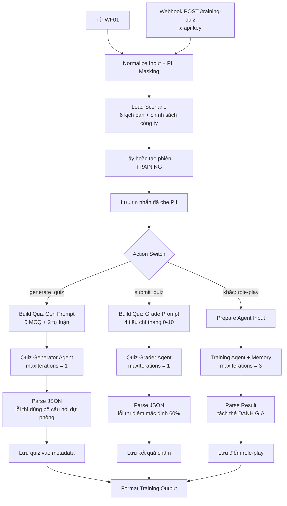
```mermaid
flowchart TD
  A1["Từ WF01"] --> N
  A2["Webhook POST /training-quiz<br/>x-api-key"] --> N
  N["Normalize Input + PII Masking"] --> L["Load Scenario<br/>6 kịch bản + chính sách công ty"]
  L --> S["Lấy hoặc tạo phiên TRAINING"] --> U["Lưu tin nhắn đã che PII"] --> SW{"Action Switch"}
  SW -->|"generate_quiz"| G1["Build Quiz Gen Prompt<br/>5 MCQ + 2 tự luận"] --> G2["Quiz Generator Agent<br/>maxIterations = 1"] --> G3["Parse JSON<br/>lỗi thì dùng bộ câu hỏi dự phòng"] --> G4["Lưu quiz vào metadata"]
  SW -->|"submit_quiz"| Q1["Build Quiz Grade Prompt<br/>4 tiêu chí thang 0-10"] --> Q2["Quiz Grader Agent<br/>maxIterations = 1"] --> Q3["Parse JSON<br/>lỗi thì điểm mặc định 60%"] --> Q4["Lưu kết quả chấm"]
  SW -->|"khác: role-play"| R1["Prepare Agent Input"] --> R2["Training Agent + Memory<br/>maxIterations = 3"] --> R3["Parse Result<br/>tách thẻ DANH GIA"] --> R4["Lưu điểm role-play"]
  G4 & Q4 & R4 --> F["Format Training Output"]
```

### Hình 3.8. CSKH Agent (WF04)

`docs/diagrams/H3-08-wf04-cskh.mmd`

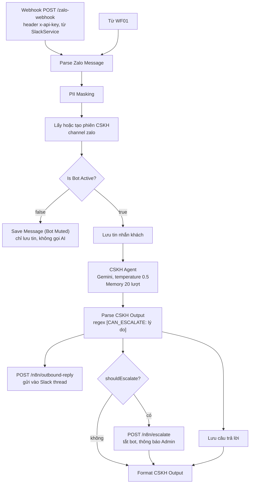
```mermaid
flowchart TD
  A1["Webhook POST /zalo-webhook<br/>header x-api-key, từ SlackService"] --> P
  A2["Từ WF01"] --> P
  P["Parse Zalo Message"] --> M["PII Masking"] --> S["Lấy hoặc tạo phiên CSKH<br/>channel zalo"]
  S --> B{"Is Bot Active?"}
  B -->|"false"| MU["Save Message (Bot Muted)<br/>chỉ lưu tin, không gọi AI"]
  B -->|"true"| U["Lưu tin nhắn khách"]
  U --> AG["CSKH Agent<br/>Gemini, temperature 0.5<br/>Memory 20 lượt"]
  AG --> PO["Parse CSKH Output<br/>regex [CAN_ESCALATE: lý do]"]
  PO --> SV["Lưu câu trả lời"]
  PO --> OR["POST /n8n/outbound-reply<br/>gửi vào Slack thread"]
  PO --> E{"shouldEscalate?"}
  E -->|"có"| ES["POST /n8n/escalate<br/>tắt bot, thông báo Admin"]
  E -->|"không"| FO["Format CSKH Output"]
  ES --> FO
  SV --> FO
```

### Hình 3.9. Đăng nhập và xác thực

`docs/diagrams/H3-09-auth.mmd`

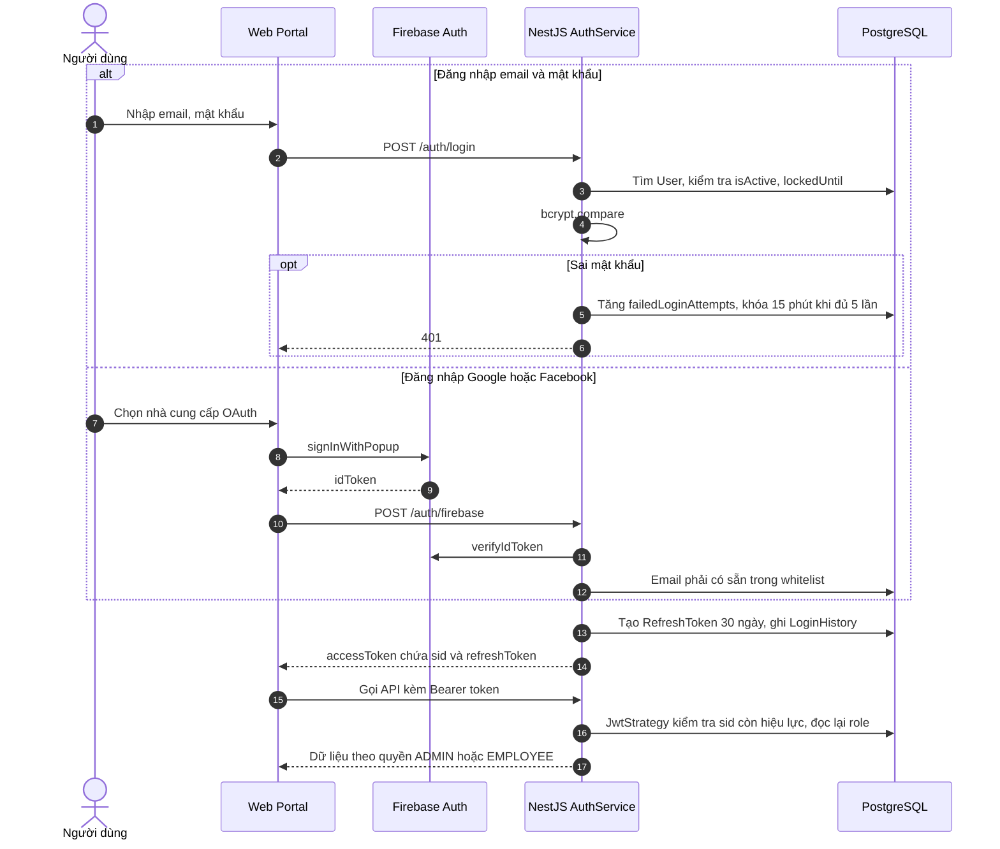
```mermaid
sequenceDiagram
  autonumber
  actor U as Người dùng
  participant W as Web Portal
  participant F as Firebase Auth
  participant A as NestJS AuthService
  participant DB as PostgreSQL
  alt Đăng nhập email và mật khẩu
    U->>W: Nhập email, mật khẩu
    W->>A: POST /auth/login
    A->>DB: Tìm User, kiểm tra isActive, lockedUntil
    A->>A: bcrypt.compare
    opt Sai mật khẩu
      A->>DB: Tăng failedLoginAttempts, khóa 15 phút khi đủ 5 lần
      A-->>W: 401
    end
  else Đăng nhập Google hoặc Facebook
    U->>W: Chọn nhà cung cấp OAuth
    W->>F: signInWithPopup
    F-->>W: idToken
    W->>A: POST /auth/firebase
    A->>F: verifyIdToken
    A->>DB: Email phải có sẵn trong whitelist
  end
  A->>DB: Tạo RefreshToken 30 ngày, ghi LoginHistory
  A-->>W: accessToken chứa sid và refreshToken
  W->>A: Gọi API kèm Bearer token
  A->>DB: JwtStrategy kiểm tra sid còn hiệu lực, đọc lại role
  A-->>W: Dữ liệu theo quyền ADMIN hoặc EMPLOYEE
```

### Hình 3.10. Cấu trúc Web Portal

`docs/diagrams/H3-10-frontend.mmd`

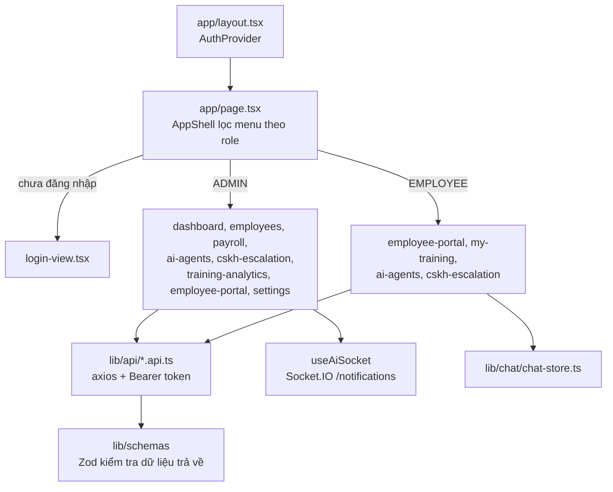
```mermaid
flowchart TD
  L["app/layout.tsx<br/>AuthProvider"] --> PG["app/page.tsx<br/>AppShell lọc menu theo role"]
  PG -->|"chưa đăng nhập"| LG["login-view.tsx"]
  PG -->|"ADMIN"| AD["dashboard, employees, payroll,<br/>ai-agents, cskh-escalation,<br/>training-analytics, employee-portal, settings"]
  PG -->|"EMPLOYEE"| EM["employee-portal, my-training,<br/>ai-agents, cskh-escalation"]
  AD & EM --> API["lib/api/*.api.ts<br/>axios + Bearer token"]
  API --> Z["lib/schemas<br/>Zod kiểm tra dữ liệu trả về"]
  AD --> SK["useAiSocket<br/>Socket.IO /notifications"]
  EM --> CH["lib/chat/chat-store.ts"]
```

### Hình 4.1. Sơ đồ triển khai

`docs/diagrams/H4-01-deployment.mmd`

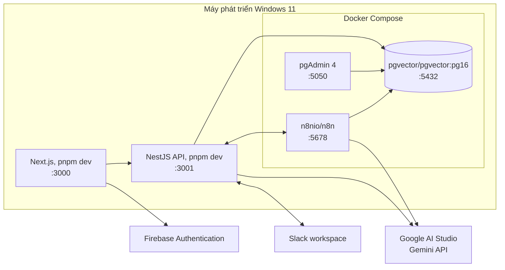
```mermaid
flowchart LR
  subgraph DEV["Máy phát triển Windows 11"]
    subgraph DC["Docker Compose"]
      PG[("pgvector/pgvector:pg16<br/>:5432")]
      N8N["n8nio/n8n<br/>:5678"]
      PGA["pgAdmin 4<br/>:5050"]
    end
    API["NestJS API, pnpm dev<br/>:3001"]
    WEB["Next.js, pnpm dev<br/>:3000"]
  end
  GEM["Google AI Studio<br/>Gemini API"]
  SLK["Slack workspace"]
  FB["Firebase Authentication"]
  WEB --> API --> PG
  N8N --> PG
  API <--> N8N
  N8N --> GEM
  API --> GEM
  API <--> SLK
  WEB --> FB
  PGA --> PG
```

### Hình 4.2. Tạo hồ sơ nhân viên

`docs/diagrams/H4-11-employee-create.mmd`

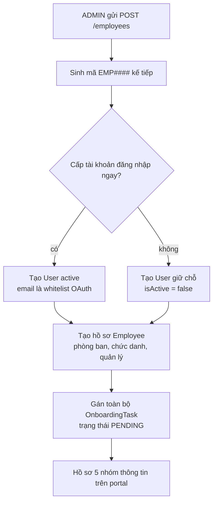
```mermaid
flowchart TD
  A["ADMIN gửi POST /employees"] --> B["Sinh mã EMP#### kế tiếp"]
  B --> C{"Cấp tài khoản đăng nhập ngay?"}
  C -->|"có"| D["Tạo User active<br/>email là whitelist OAuth"]
  C -->|"không"| E["Tạo User giữ chỗ<br/>isActive = false"]
  D & E --> F["Tạo hồ sơ Employee<br/>phòng ban, chức danh, quản lý"]
  F --> G["Gán toàn bộ OnboardingTask<br/>trạng thái PENDING"]
  G --> H["Hồ sơ 5 nhóm thông tin trên portal"]
```

### Hình 4.3. Chấm công GPS

`docs/diagrams/H4-02-attendance.mmd`

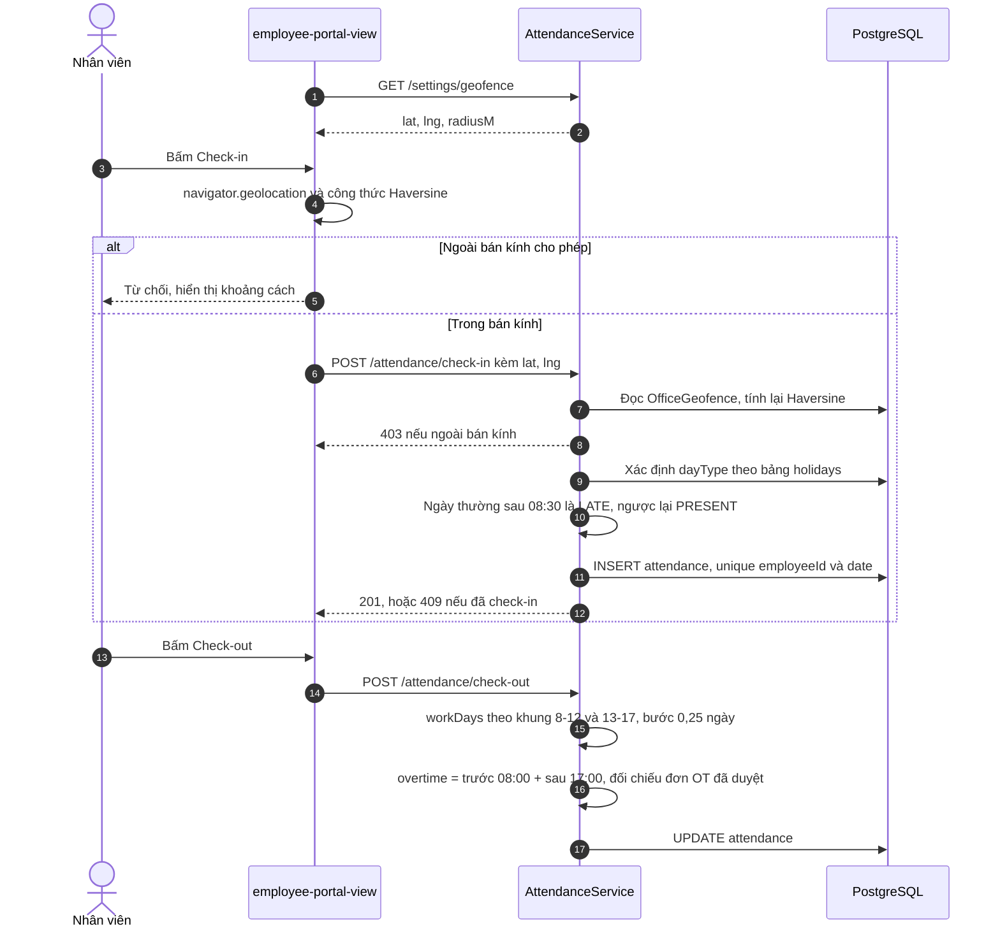
```mermaid
sequenceDiagram
  autonumber
  actor E as Nhân viên
  participant W as employee-portal-view
  participant A as AttendanceService
  participant DB as PostgreSQL
  W->>A: GET /settings/geofence
  A-->>W: lat, lng, radiusM
  E->>W: Bấm Check-in
  W->>W: navigator.geolocation và công thức Haversine
  alt Ngoài bán kính cho phép
    W-->>E: Từ chối, hiển thị khoảng cách
  else Trong bán kính
    W->>A: POST /attendance/check-in kèm lat, lng
    A->>DB: Đọc OfficeGeofence, tính lại Haversine
    A-->>W: 403 nếu ngoài bán kính
    A->>DB: Xác định dayType theo bảng holidays
    A->>A: Ngày thường sau 08:30 là LATE, ngược lại PRESENT
    A->>DB: INSERT attendance, unique employeeId và date
    A-->>W: 201, hoặc 409 nếu đã check-in
  end
  E->>W: Bấm Check-out
  W->>A: POST /attendance/check-out
  A->>A: workDays theo khung 8-12 và 13-17, bước 0,25 ngày
  A->>A: overtime = trước 08:00 + sau 17:00, đối chiếu đơn OT đã duyệt
  A->>DB: UPDATE attendance
```

### Hình 4.4. Trạng thái đơn nghỉ phép

`docs/diagrams/H4-03-leave-state.mmd`

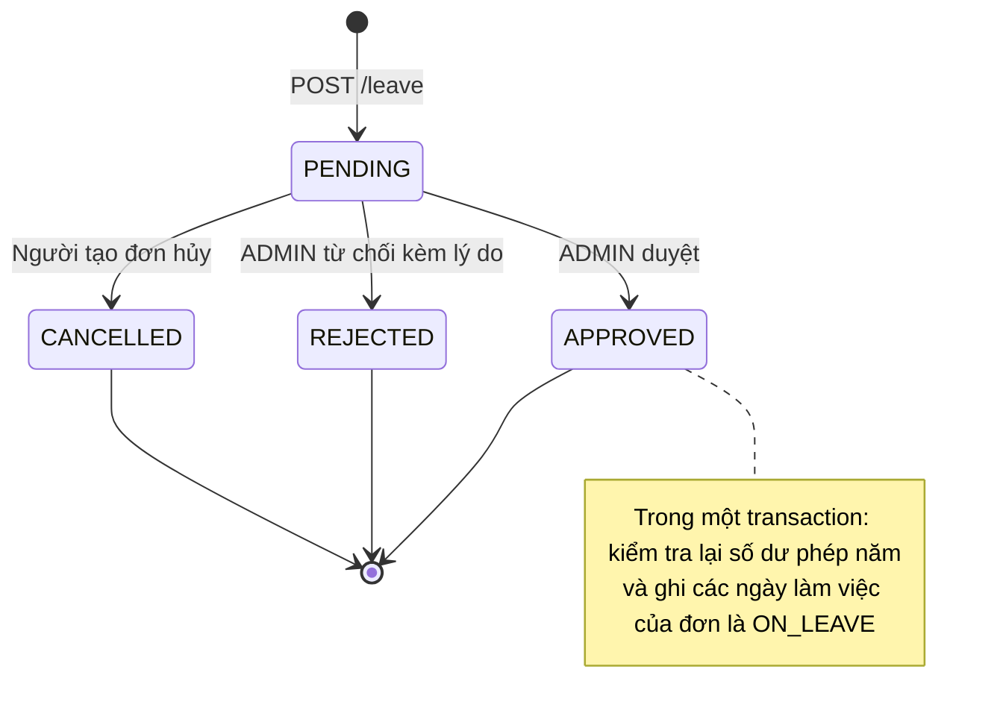
```mermaid
stateDiagram-v2
  [*] --> PENDING: POST /leave
  PENDING --> APPROVED: ADMIN duyệt
  PENDING --> REJECTED: ADMIN từ chối kèm lý do
  PENDING --> CANCELLED: Người tạo đơn hủy
  APPROVED --> [*]
  REJECTED --> [*]
  CANCELLED --> [*]
  note right of APPROVED
    Trong một transaction: kiểm tra lại số dư phép năm
    và ghi các ngày làm việc của đơn là ON_LEAVE
  end note
```

### Hình 4.5. Gửi và duyệt đơn nghỉ phép

`docs/diagrams/H4-04-leave-approve.mmd`

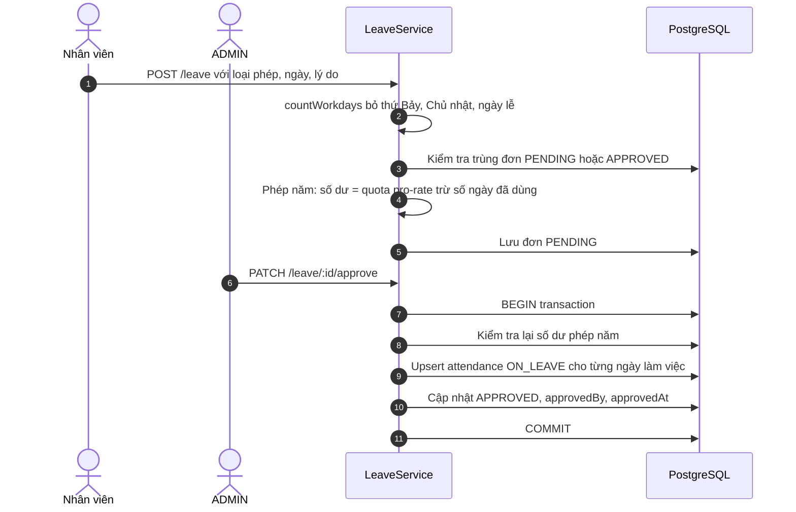
```mermaid
sequenceDiagram
  autonumber
  actor E as Nhân viên
  actor AD as ADMIN
  participant L as LeaveService
  participant DB as PostgreSQL
  E->>L: POST /leave với loại phép, ngày, lý do
  L->>L: countWorkdays bỏ thứ Bảy, Chủ nhật, ngày lễ
  L->>DB: Kiểm tra trùng đơn PENDING hoặc APPROVED
  L->>L: Phép năm: số dư = quota pro-rate trừ số ngày đã dùng
  L->>DB: Lưu đơn PENDING
  AD->>L: PATCH /leave/:id/approve
  L->>DB: BEGIN transaction
  L->>DB: Kiểm tra lại số dư phép năm
  L->>DB: Upsert attendance ON_LEAVE cho từng ngày làm việc
  L->>DB: Cập nhật APPROVED, approvedBy, approvedAt
  L->>DB: COMMIT
```

### Hình 4.6. Rule Engine tính lương

`docs/diagrams/H4-05-payroll-engine.mmd`

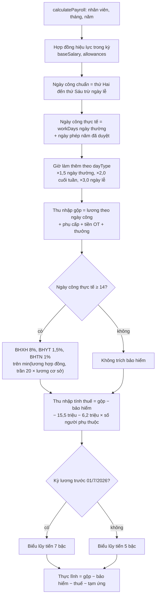
```mermaid
flowchart TD
  S["calculatePayroll: nhân viên, tháng, năm"] --> C["Hợp đồng hiệu lực trong kỳ<br/>baseSalary, allowances"]
  C --> W["Ngày công chuẩn = thứ Hai đến thứ Sáu trừ ngày lễ"]
  W --> A["Ngày công thực tế = workDays ngày thường<br/>+ ngày phép năm đã duyệt"]
  A --> OT["Giờ làm thêm theo dayType<br/>×1,5 ngày thường, ×2,0 cuối tuần, ×3,0 ngày lễ"]
  OT --> G["Thu nhập gộp = lương theo ngày công<br/>+ phụ cấp + tiền OT + thưởng"]
  G --> I{"Ngày công thực tế ≥ 14?"}
  I -->|"có"| BH["BHXH 8%, BHYT 1,5%, BHTN 1%<br/>trên min(lương hợp đồng, trần 20 × lương cơ sở)"]
  I -->|"không"| NB["Không trích bảo hiểm"]
  BH & NB --> TX["Thu nhập tính thuế = gộp − bảo hiểm<br/>− 15,5 triệu − 6,2 triệu × số người phụ thuộc"]
  TX --> R{"Kỳ lương trước 01/7/2026?"}
  R -->|"có"| P7["Biểu lũy tiến 7 bậc"]
  R -->|"không"| P5["Biểu lũy tiến 5 bậc"]
  P7 & P5 --> N["Thực lĩnh = gộp − bảo hiểm − thuế − tạm ứng"]
```

### Hình 4.7. Trạng thái phiếu lương

`docs/diagrams/H4-06-payroll-state.mmd`

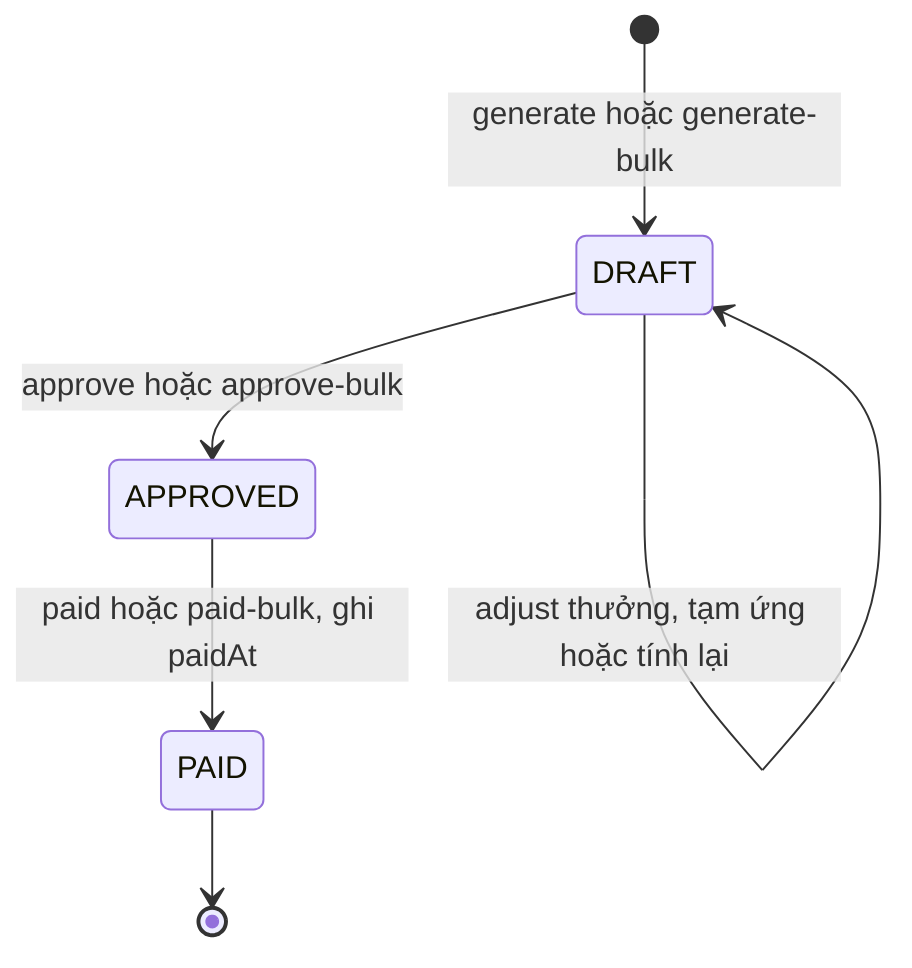
```mermaid
stateDiagram-v2
  [*] --> DRAFT: generate hoặc generate-bulk
  DRAFT --> DRAFT: adjust thưởng, tạm ứng hoặc tính lại
  DRAFT --> APPROVED: approve hoặc approve-bulk
  APPROVED --> PAID: paid hoặc paid-bulk, ghi paidAt
  PAID --> [*]
```

### Hình 4.8. Cài đặt và nhật ký thay đổi

`docs/diagrams/H4-12-settings-audit.mmd`

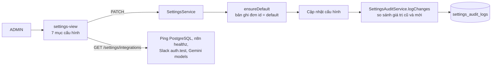
```mermaid
flowchart LR
  AD["ADMIN"] --> UI["settings-view<br/>7 mục cấu hình"]
  UI -->|"PATCH"| SV["SettingsService"]
  SV --> R["ensureDefault<br/>bản ghi đơn id = default"]
  R --> U["Cập nhật cấu hình"]
  U --> L["SettingsAuditService.logChanges<br/>so sánh giá trị cũ và mới"]
  L --> DB[("settings_audit_logs")]
  UI -->|"GET /settings/integrations"| P["Ping PostgreSQL, n8n healthz,<br/>Slack auth.test, Gemini models"]
```

### Hình 4.9. Hỏi đáp lương qua HR Agent

`docs/diagrams/H4-07-hr-chat.mmd`

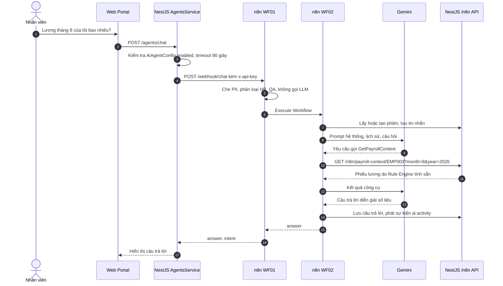
```mermaid
sequenceDiagram
  autonumber
  actor E as Nhân viên
  participant W as Web Portal
  participant A as NestJS AgentsService
  participant R as n8n WF01
  participant H as n8n WF02
  participant G as Gemini
  participant T as NestJS /n8n API
  E->>W: Lương tháng 8 của tôi bao nhiêu?
  W->>A: POST /agents/chat
  A->>A: Kiểm tra AiAgentConfig.enabled, timeout 90 giây
  A->>R: POST /webhook/chat kèm x-api-key
  R->>R: Che PII, phân loại HR_QA, không gọi LLM
  R->>H: Execute Workflow
  H->>T: Lấy hoặc tạo phiên, lưu tin nhắn
  H->>G: Prompt hệ thống, lịch sử, câu hỏi
  G-->>H: Yêu cầu gọi GetPayrollContext
  H->>T: GET /n8n/payroll-context/EMP003?month=8&year=2026
  T-->>H: Phiếu lương do Rule Engine tính sẵn
  H->>G: Kết quả công cụ
  G-->>H: Câu trả lời diễn giải số liệu
  H->>T: Lưu câu trả lời, phát sự kiện ai:activity
  H-->>R: answer
  R-->>A: answer, intent
  A-->>W: Hiển thị câu trả lời
```

### Hình 4.10. Truy xuất chính sách (RAG)

`docs/diagrams/H4-08-rag.mmd`

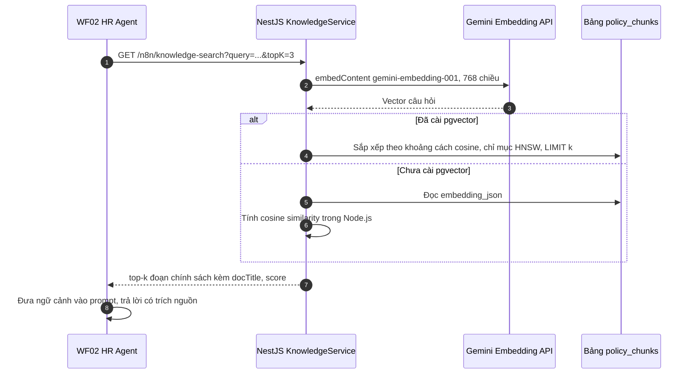
```mermaid
sequenceDiagram
  autonumber
  participant H as WF02 HR Agent
  participant K as NestJS KnowledgeService
  participant G as Gemini Embedding API
  participant DB as Bảng policy_chunks
  H->>K: GET /n8n/knowledge-search?query=...&topK=3
  K->>G: embedContent gemini-embedding-001, 768 chiều
  G-->>K: Vector câu hỏi
  alt Đã cài pgvector
    K->>DB: Sắp xếp theo khoảng cách cosine, chỉ mục HNSW, LIMIT k
  else Chưa cài pgvector
    K->>DB: Đọc embedding_json
    K->>K: Tính cosine similarity trong Node.js
  end
  K-->>H: top-k đoạn chính sách kèm docTitle, score
  H->>H: Đưa ngữ cảnh vào prompt, trả lời có trích nguồn
```

### Hình 4.11. Sinh và chấm bài kiểm tra

`docs/diagrams/H4-09-quiz.mmd`

```mermaid
sequenceDiagram
  autonumber
  actor E as Nhân viên
  participant W as my-training-view
  participant A as NestJS
  participant T as n8n WF03
  participant G as Gemini
  E->>W: Chọn kịch bản, bắt đầu bài test
  W->>A: POST /agents/chat, action generate_quiz
  A->>T: Chuyển qua WF01
  T->>G: Sinh 5 MCQ và 2 câu tự luận dạng JSON
  G-->>T: questions
  T-->>A: questions kèm đáp án đúng
  A->>A: Lưu đáp án vào metadata.quiz, gỡ correctAnswer
  A-->>W: Câu hỏi không kèm đáp án
  E->>W: Nộp bài
  W->>A: POST /training/submit
  A->>A: Tối đa 5 lần mỗi kịch bản mỗi ngày
  A->>T: POST /webhook/training-quiz, submit_quiz, timeout 60 giây
  T->>G: Chấm tự luận theo 4 tiêu chí
  G-->>T: results, criteria
  T-->>A: Kết quả chấm
  A->>A: Chấm MCQ phía server theo đáp án đã lưu
  A->>A: Tổng điểm = 0,5 × điểm MCQ + 0,5 × điểm tự luận × 10
  A-->>W: TrainingSession GRADED, radar 4 tiêu chí
```

### Hình 4.12. CSKH và leo thang

`docs/diagrams/H4-10-cskh-escalation.mmd`

```mermaid
sequenceDiagram
  autonumber
  actor K as Khách hàng
  participant S as Slack
  participant N as NestJS SlackService
  participant C as n8n WF04
  participant G as Gemini
  participant A as NestJS AiContextService
  participant P as Admin Portal
  K->>S: Nhắn tin
  S->>N: Sự kiện message qua Socket Mode
  N->>C: POST /webhook/zalo-webhook
  C->>C: Che PII, lấy phiên CSKH
  C->>G: Câu hỏi và lịch sử hội thoại
  G-->>C: Trả lời, có thể kèm thẻ CAN_ESCALATE
  C->>A: POST /n8n/outbound-reply
  A->>S: chat.postMessage vào thread
  opt Cần leo thang
    C->>A: POST /n8n/escalate
    A->>A: isActive = false, escalatedAt = now
    A->>P: WebSocket notification:new tới phòng admin
    P->>A: POST /agents/chat-session/:id/reply
    A->>S: Nhân viên trả lời khách trong thread
  end
  Note over A: Cron 00:00 giờ Việt Nam bật lại bot cho các phiên CSKH đã leo thang
```

---

*Liên kết:* [[32 - Rà Soát & Sửa 16 Lỗi Mã Nguồn (02-11-2026)]] | [[09 - Task Checklist]] | [[29 - Snapshot Toàn Hệ Thống 16-10-2026]] | [[30 - Business Logic & ADR Alignment (Verified 17-10-2026)]] | [[06 - n8n Workflows & AI Agents]]
